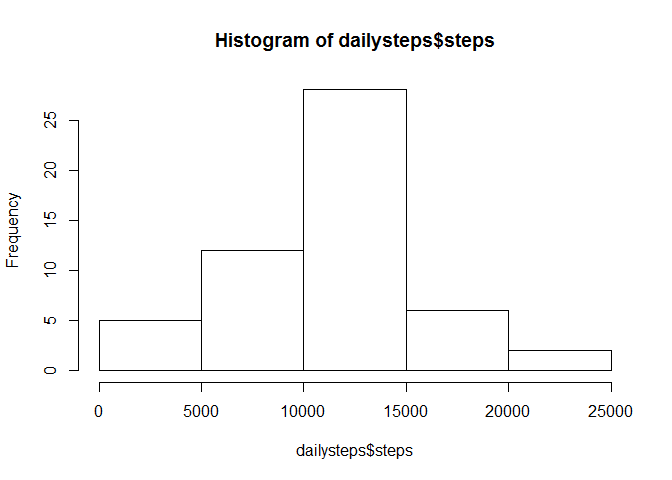
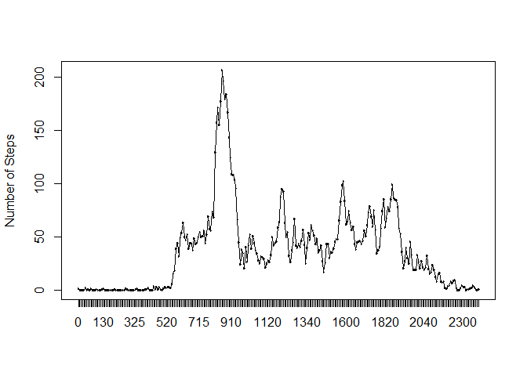
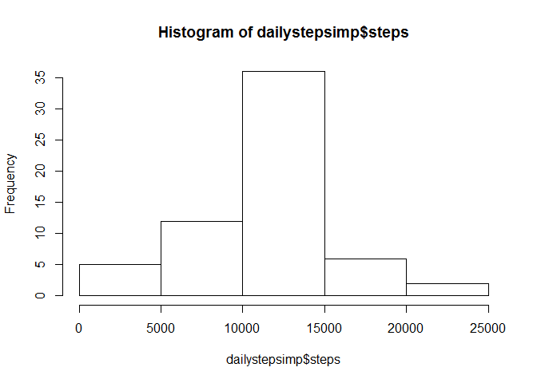
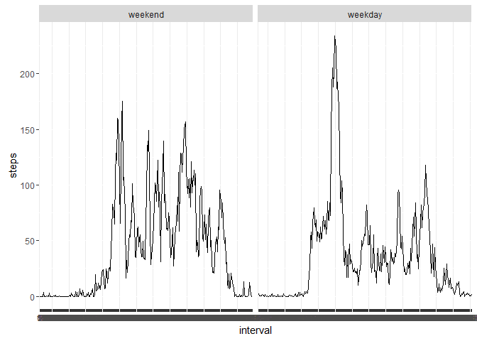

# Reproducible Research: Peer Assessment 1


This is the markdown file for the first peer review project for Reproducible Research. Course 5 in the Data Science Specialization. The below code chuck will read in the raw data for the project. This data frame consists of:

- Three Columns:
    1.  Year
    2.  Steps
    3.  Interval
- 17568 observations


##Questions 1 & 2: Loading and preprocessing the data

```r
library(dplyr)
```

```
## 
## Attaching package: 'dplyr'
```

```
## The following objects are masked from 'package:stats':
## 
##     filter, lag
```

```
## The following objects are masked from 'package:base':
## 
##     intersect, setdiff, setequal, union
```

```r
library(ggplot2)
library(mice)
```

```
## Loading required package: Rcpp
```

```
## mice 2.25 2015-11-09
```

```r
library(VIM)
```

```
## Loading required package: colorspace
```

```
## Loading required package: grid
```

```
## Loading required package: data.table
```

```
## -------------------------------------------------------------------------
```

```
## data.table + dplyr code now lives in dtplyr.
## Please library(dtplyr)!
```

```
## -------------------------------------------------------------------------
```

```
## 
## Attaching package: 'data.table'
```

```
## The following objects are masked from 'package:dplyr':
## 
##     between, last
```

```
## VIM is ready to use. 
##  Since version 4.0.0 the GUI is in its own package VIMGUI.
## 
##           Please use the package to use the new (and old) GUI.
```

```
## Suggestions and bug-reports can be submitted at: https://github.com/alexkowa/VIM/issues
```

```
## 
## Attaching package: 'VIM'
```

```
## The following object is masked from 'package:datasets':
## 
##     sleep
```

```r
library(impute)
library(reshape2)
```

```
## 
## Attaching package: 'reshape2'
```

```
## The following objects are masked from 'package:data.table':
## 
##     dcast, melt
```

```r
setwd("C:/Users/rballard/Desktop/Personal/Data Science Certification/repres/RepData_PeerAssessment1")

activity <- read.csv(file="activity.csv")
activity$date<-as.Date(activity$date,format="%Y-%m-%d") #Date format entries
activity$interval<-as.factor(activity$interval) #Set interval as factor

#Total steps for each day:
dailysteps<-aggregate(steps~date,data=activity,FUN=sum,na.rm=TRUE)

#Average Steps for each interval:
avgintsteps<-aggregate(steps~interval,activity,FUN=mean,na.rm=TRUE)
```

##Histogram of Number of Daily Steps


```r
hist(dailysteps$steps)
```

<!-- -->


##What is mean total number of steps taken per day?


```r
dailystepmean<-mean(dailysteps$steps)
dailystepmedian<-median(dailysteps$steps)
```

##Time series plot of the average number of steps taken


```r
plot(x=avgintsteps$interval , y=avgintsteps$steps , ylab="Number of Steps", type = "n")
lines(avgintsteps$interval, avgintsteps$steps)
```

<!-- -->

## What is the average daily activity pattern?


```r
#NUMBER 5

with(avgintsteps,interval[which.max(steps)])
```

```
## [1] 835
## 288 Levels: 0 5 10 15 20 25 30 35 40 45 50 55 100 105 110 115 120 ... 2355
```


## Imputing missing values

Using md.pattern(), a function in the 'mice' package which tabulates missing row data, there are 2304 rows in the activities dataframe with missing steps data.


```r
#Exploratory data analysis ebook p.136
#https://www.r-bloggers.com/imputing-missing-data-with-r-mice-package/

md.pattern(activity) #This function is in the mice package.
```

```
##       date interval steps     
## 15264    1        1     1    0
##  2304    1        1     0    1
##          0        0  2304 2304
```

```r
#md.pattern() tabulates missing values in a dataframe.

#http://stackoverflow.com/questions/9322773/how-to-replace-na-with-mean-by-subset-in-r-impute-with-plyr
impute.mean <- function(x) replace(x, is.na(x), mean(x, na.rm = TRUE))

activityimp<-activity %>%
    group_by(interval) %>%
    mutate(
        steps = impute.mean(steps)
    )

dailystepsimp<-aggregate(steps~date,data=activityimp,FUN=sum,na.rm=TRUE)
dailystepimpmean<-mean(dailystepsimp$steps)
dailystepimpmedian<-median(dailystepsimp$steps)
hist(dailystepsimp$steps)
```

<!-- -->


## Are there differences in activity patterns between weekdays and weekends?


```r
#Lists "Weekdays"
weekdays1 <- c('Monday', 'Tuesday', 'Wednesday', 'Thursday', 'Friday')

#Creates new column testing if the day of the week in the date column is a "Weekday"
activity$wDay <- factor((weekdays(activity$date) %in% weekdays1), 
         levels=c(FALSE, TRUE), labels=c('weekend', 'weekday')) 

avgintstepswday<-aggregate(steps~interval+wDay,data=activity,mean)


ggplot(data=avgintstepswday,aes(x=interval,y=steps,group=1))+geom_line() + facet_grid(~wDay)
```

<!-- -->
